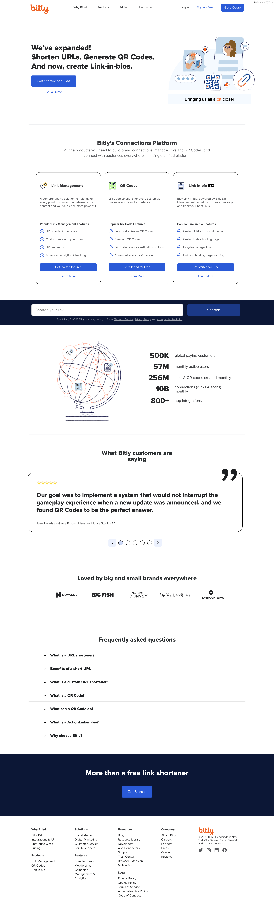

## A clone of Bitly landing

A schowcase of css skills.

**Demo: https://tanyaignatenko.github.io/Bitly-Landing/**

- Made a responsive layout 
- Added support for mobile and tablets
- Made a cross-browser layout 
- Made the layout accessible
- Optimized the loading of images

### Desktop layout:

### Mobile layout:

